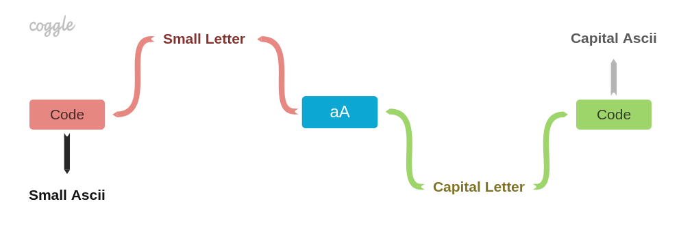

# Char Converter

The example of applying a constraint programming paradigm for converting Characters to/from Ascii codes and changing their cases.
The System (a network built of connectors and constraints) is represented by the diagram:

It allows to set a value of any connector and get a calculated result on all other connectors by propagating updates using the message passing approach.
